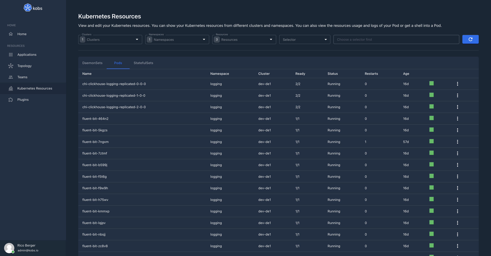
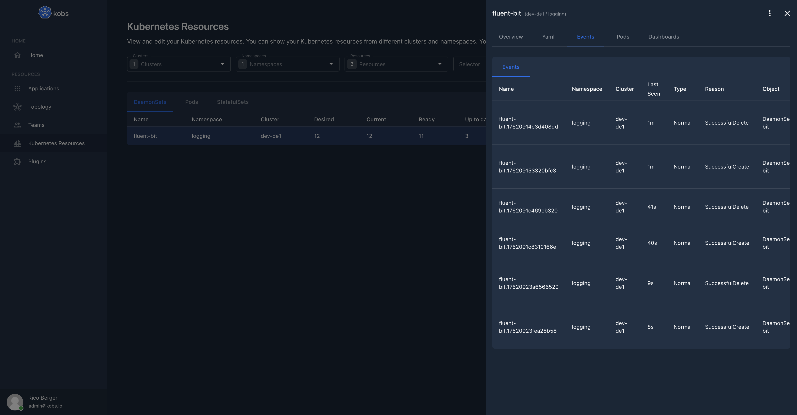

# Resources

kobs supports all Kubernetes objects like Pods, Deployments, StatefulSets and Custom Resources. Ensure that kobs has enough permissions to retrieve all these resources from the Kubernetes API server. If you are using the [Helm chart](../installation/helm.md) or [Kustomize](../installation/kustomize.md) to install kobs, it will automatically create the correct Cluster Role and Cluster Role Binding, so that you can view all these resources.

You can access the Kubernetes objects via the **Resources** item on the home page of kobs.

In the toolbar of the resources page, you can select the clusters, resources and namespaces for which you want to view the resources. The results are group by the resource type. The table for each resource contains the same fields as `kubectl` for the standard Kubernetes objects. For Custom Resources the fields defined in the `additionalPrinterColumns` of the Custom Resource Definition are shown.

By selecting an item in the table, you can view some details for this resource. For example you can view the yaml representation for the selected resource.

Next to the yaml representation, you find a seconde tab events, which shows all events, which are related to the selected object. The events are retrieved with a field selector and the name of the resource: `fieldSelector=involvedObject.name=<NAME-OF-THE-RESOURCE>`.

