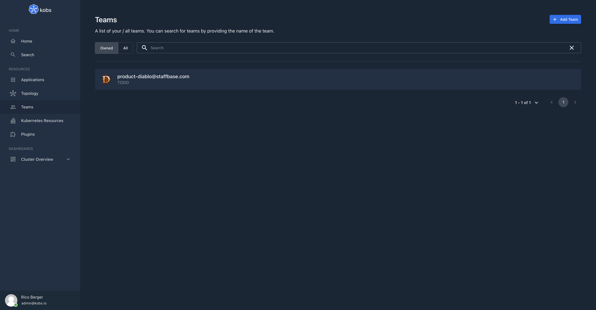
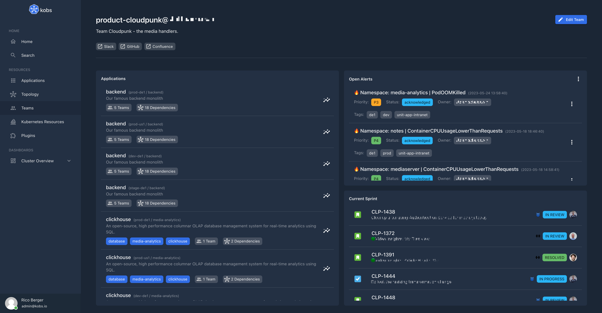

# Teams

Teams are defined via the [Team Custom Resource Definition](https://github.com/kobsio/kobs/blob/main/deploy/kustomize/crds/kobs.io_teams.yaml). Teams can be used to define the ownership for applications and to grant users access to several resources.

You can access all teams / the teams you are allowed to see via the teams page.



## Specification

In the following you can found the specification for the Team CRD.

| Field | Type | Description | Required |
| ----- | ---- | ----------- | -------- |
| group | string | The group name of the team. This is used to connect the authenticated user with this CR. | Yes |
| description | string | A description for the team. | No |
| links | [[]Link](#link) | A list of links (e.g. a link to the teams Slack channel, Confluence page, etc.) | No |
| logo | string | The logo for the team. Must be a path to an image file. | No |
| permissions | [Permissions](./users.md#permissions) | Permissions for the team when the authentication / authorization middleware is enabled. | No |
| dashboards | [[]Dashboard](./applications.md#dashboard) | A list of dashboards which will be shown on the team page. | No |
| notifications | [Notifications](./users.md#notifications) | Overwrite the global notification settings for this team. | No |

### Link

| Field | Type | Description | Required |
| ----- | ---- | ----------- | -------- |
| title | string | Title for the link. | Yes |
| link | string | The actuall link. | Yes |

## Example

The following CR creates a team with the group `dia@kobs.io`. The details page for the team contains two dashboards, one to display the applications owned by the team and a seconde one to display the status of external services via the RSS plugin.

In the CR we also define that every member of the team can view all applications and teams. Every member can also view the Helm charts in the `bookinfo` and `kobs` namespace and can use the Opsgenie plugin. Besides that every member can also list, edit and delete all resources in the `bookinfo` and `kobs` namespace.

```yaml
---
apiVersion: kobs.io/v1
kind: Team
metadata:
  name: team-diablo
  namespace: kobs
spec:
  group: dia@kobs.io
  description: Productpage and Details
  logo: https://kobs.io/main/installation/assets/team-diablo.png
  links:
    - title: Website
      link: https://kobs.io
    - title: GitHub
      link: https://github.com/kobsio/kobs
  dashboards:
    - title: Applications
      inline:
        rows:
          - size: -1
            panels:
              - title: Applications
                plugin:
                  name: applications
                  type: app
                  options:
                    team: dia@kobs.io
    - title: Status of External Services
      inline:
        rows:
          - size: -1
            panels:
              - title: External Services
                plugin:
                  name: rss
                  type: rss
                  options:
                    urls:
                      - https://www.githubstatus.com/history.rss
                      - https://status.aws.amazon.com/rss/route53.rss
                      - https://azurestatuscdn.azureedge.net/de-de/status/feed/
                      - https://www.cloudflarestatus.com/history.atom
                    sortBy: updated
  permissions:
    applications:
      - type: all
    teams:
      - "*"
    plugins:
      - satellite: "*"
        name: helm
        type: helm
        permissions:
          - clusters:
              - "*"
            namespaces:
              - "bookinfo"
              - "kobs"
            names:
              - "*"
      - satellite: "*"
        name: opsgenie
        type: opsgenie
        permissions:
          - acknowledgeAlert
          - snoozeAlert
          - closeAlert
    resources:
      - satellites:
          - "*"
        clusters:
          - "*"
        namespaces:
          - "bookinfo"
          - "kobs"
        resources:
          - "*"
        verbs:
          - "*"
```


