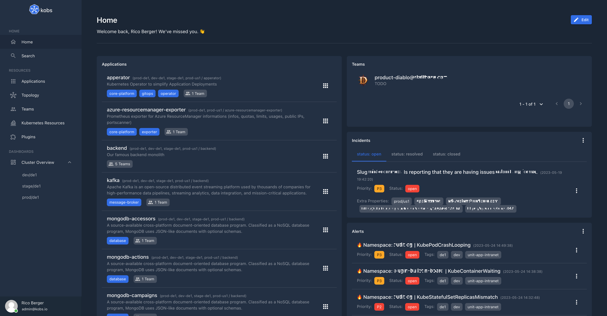

# Users

Users are defined via the [User Custom Resource Definition](https://github.com/kobsio/kobs/blob/main/deploy/kustomize/crds/kobs.io_users.yaml). Users can be used to define the username and password for the authentication of users, their permissions within kobs, navigation and dashboards.



## Specification

In the following you can found the specification for the User CRD.

| Field | Type | Description | Required |
| ----- | ---- | ----------- | -------- |
| id | string | The `id` of the authenticated user (e.g. the users email address). | Yes |
| displayName | string | The name of the user, how it should be displayed in the frontend. | No |
| password | string | The password of the user. A password could be generated using the following command `htpasswd -nBC 10 "" | tr -d ':\n'` | No |
| teams | []string | A list of teams where the user is a member of. | No |
| permissions | [Permissions](#permissions) | Permissions for the user when the authentication / authorization middleware is enabled. | No |
| dashboards | [[]Dashboard](./applications.md#dashboard) | A list of dashboards which will be shown on the users home page. | No |
| navigation | [[]Navigation](#navigation) | A list of navigation items which will be shown in the sidebar. | No |

### Permissions

| Field | Type | Description | Required |
| ----- | ---- | ----------- | -------- |
| applications | [[]Application](#application) | Define a list of application permissions, to specify which applications can be accessed by a user | Yes |
| teams | []string | Define a list of teams (must match the corresponding `group` field of a team) which can be viewed by a user. The specifal character `*` can be used to allow a user to view all teams | Yes |
| plugins | [[]Plugin](#plugin) | A list of plugins, which can be accessed by a user. | Yes |
| resources | [[]Resources](#resources) | A list of resources, which can be accessed by the user. | Yes |

#### Application

| Field | Type | Description | Required |
| ----- | ---- | ----------- | -------- |
| type | string | The type which should be used for the application permissions. This must be `all` to allow access to all applications, `own` to only allow access to applications owned by a team where the user is part of or `custom` to set the permissions based on satellites, clusters and namespaces. | Yes |
| clusters | []string | A list of clusters from which applications can be accessed by the user, when the permission type is `custom`. The special character `*` can be used to include all clusters. | No |
| namespaces | []string | A list of namespaces from which applications can be accessed by the user, when the permission type is `custom`. The special character `*` can be used to include all namespaces. | No |

#### Plugin

| Field | Type | Description | Required |
| ----- | ---- | ----------- | -------- |
| cluster | string | The cluster of the plugin instance, where it is configured. The special character `*` can be used to include all clusters. | Yes |
| name | string | The name of the plugin instance as it is defined in the configuration. The special character `*` can be used to include all names. | Yes |
| type | string | The type of the plugin instance as it is defined in the configuration. The special character `*` can be used to include all types. | Yes |
| permissions | any | The permissions, which should be grant to a user. The format of this property is different for each plugin. You can find an example for each plugin on the corresponding plugin page in the documentation. | No |

#### Resources

| Field | Type | Description | Required |
| ----- | ---- | ----------- | -------- |
| clusters | []string | A list of clusters to allow access to. The special list entry `*` allows access to all clusters. | Yes |
| namespaces | []string | A list of namespaces to allow access to. The special list entry `*` allows access to all namespaces. | Yes |
| resources | []string | A list of resources to allow access to. The special list entry `*` allows access to all resources. | Yes |
| verbs | []string | A list of verbs to allow access to. The following verbs are possible: `get`, `patch`, `post`, `delete` and `*`. The special list entry `*` allows access for all verbs. | Yes |

!!! note
    The following strings can be used in the resources list: `cronjobs`, `daemonsets`, `deployments`, `jobs`, `pods`, `replicasets`, `statefulsets`, `endpoints`, `horizontalpodautoscalers`, `ingresses`, `networkpolicies`, `services`, `configmaps`, `persistentvolumeclaims`, `persistentvolumes`, `poddisruptionbudgets`, `secrets`, `serviceaccounts`, `storageclasses`, `clusterrolebindings`, `clusterroles`, `rolebindings`, `roles`, `events`, `nodes`.

    The special terms `pods/logs` and `pods/exec` can be used to allow users to get the logs or a terminal for a Pod. To download / upload a file from / to a Pod a user also needs the `pods/exec` resource. The `pods/logs` and `pods/exec` permission can only be set together with the `*` value for the `verbs` parameter.

    A Custom Resource can be specified in the following form `<name>.<group>/<version>` (e.g. `vaultsecrets.ricoberger.de/v1alpha1`).

### Navigation

| Field | Type | Description | Required |
| ----- | ---- | ----------- | -------- |
| name | string | The name of the navigation group as it is shown in the sidebar. | No |
| items | [[]Item](#item) | A list of sidebar items which should be displayed within this group. | No |

#### Item

| Field | Type | Description | Required |
| ----- | ---- | ----------- | -------- |
| name | string | The name for navigation item as it is shown in the sidebar. | Yes |
| icon | string | The icon which should be used for the sidebar item. Must be `apps`, `barChart`, `dashboard`, `default`, `documentation`, `donutChart`, `grid`, `home`, `kubernetes`, `lineChart`, `list`, `pieChart`, `plugin`, `search`, `table`, `team`, `topology`, `user` or `widgets`. | No |
| link | string | The link which is opened when a user clicks on the sidebar item. | No |
| page |  [Page](#page) | The page which should be opened when a user clicks on the sidebar item. | No |
| items | [[]SubItem](#subitem) | A list of subitems when the sidebar item should not open a link or page and is used as an additional group. | No |

#### SubItem

| Field | Type | Description | Required |
| ----- | ---- | ----------- | -------- |
| name | string | The name for navigation item as it is shown in the sidebar. | Yes |
| link | string | The link which is opened when a user clicks on the sidebar item. | No |
| page | [Page](#page) | The page which should be opened when a user clicks on the sidebar item. | No |

#### Page

| Field | Type | Description | Required |
| ----- | ---- | ----------- | -------- |
| title | string | The title of the page. | Yes |
| description | string | A description of the page. | Yes |
| dashboards | [[]Dashboard](./applications.md#dashboard) | A list of dashboards which will be shown on the page. | Yes |

## Example

In the CR defines that the user with the email `rico@kobs.io` can view all applications and teams. He can also view the Helm charts in the `bookinfo` and `kobs` namespace and can use the Opsgenie plugin. Besides that he can also list, edit and delete all resources in the `bookinfo` and `kobs` namespace.

The following CR defines a new user `admin@kobs.io` who can view all applications and teams and resources. The user also defines a custom home page and a custom navigation. A screenshot of the home page and sidebar navigation for this user can be found at the start of the page.

??? note "User"

    ```yaml
    ---
    apiVersion: kobs.io/v1
    kind: User
    metadata:
      name: ricoberger
      namespace: kobs
    spec:
      id: admin@kobs.io
      displayName: Rico Berger
      # password: admin
      password: $2y$10$GAzb7t1vqK0BYFQb84DnwuZx1TIIjEwMhMRjK0j6uv0B3djgWuSZu
      teams:
        - product-diablo@staffbase.com
      permissions:
        applications:
          - type: all
        teams:
          - "*"
        plugins:
          - cluster: "*"
            name: "*"
            type: "*"
        resources:
          - clusters:
              - "*"
            namespaces:
              - "*"
            resources:
              - "*"
            verbs:
              - "*"
      navigation:
        - name: Home
          items:
            - name: Home
              icon: home
              link: "/"
            - name: Search
              icon: search
              link: "/search"
        - name: Resources
          items:
            - name: Applications
              icon: apps
              link: "/applications"
            - name: Topology
              icon: topology
              link: "/topology"
            - name: Teams
              icon: team
              link: "/teams"
            - name: Kubernetes Resources
              icon: kubernetes
              link: "/resources"
            - name: Plugins
              icon: plugin
              link: "/plugins"
        - name: Dashboards
          items:
            - name: Cluster Overview
              icon: dashboard
              items:
                - name: dev/de1
                  page:
                    title: dev/de1
                    description: Cluster overview for the dev/de1 cluster
                    dashboards:
                      - namespace: kobs
                        name: cluster-overview
                        title: Cluster Overview
                        placeholders:
                          cluster: dev/de1
                      - namespace: kobs
                        name: service-mesh-overview
                        title: Service Mesh Overview
                        placeholders:
                          cluster: dev/de1
                      - namespace: kobs
                        name: loadbalancer-overview
                        title: Load Balancer Overview
                        placeholders:
                          cluster: dev/de1
                - name: stage/de1
                  page:
                    title: stage/de1
                    description: Cluster overview for the stage/de1 cluster
                    dashboards:
                      - namespace: kobs
                        name: cluster-overview
                        title: Cluster Overview
                        placeholders:
                          cluster: stage/de1
                      - namespace: kobs
                        name: service-mesh-overview
                        title: Service Mesh Overview
                        placeholders:
                          cluster: stage/de1
                      - namespace: kobs
                        name: loadbalancer-overview
                        title: Load Balancer Overview
                        placeholders:
                          cluster: stage/de1
                - name: prod/de1
                  page:
                    title: prod/de1
                    description: Cluster overview for the prod/de1 cluster
                    dashboards:
                      - namespace: kobs
                        name: cluster-overview
                        title: Cluster Overview
                        placeholders:
                          cluster: prod/de1
                      - namespace: kobs
                        name: service-mesh-overview
                        title: Service Mesh Overview
                        placeholders:
                          cluster: prod/de1
                      - namespace: kobs
                        name: loadbalancer-overview
                        title: Load Balancer Overview
                        placeholders:
                          cluster: prod/de1
      dashboards:
        - title: Home
          inline:
            hideToolbar: true
            rows:
              - autoHeight: false
                panels:
                  - title: Applications
                    w: 6
                    h: 19
                    plugin:
                      type: core
                      name: applicationgroups
                      options:
                        groups:
                          - namespace
                          - name
                    x: 0
                    'y': 0
                  - title: Teams
                    w: 6
                    h: 5
                    plugin:
                      type: core
                      name: teams
                    x: 6
                    'y': 0
                  - description: ''
                    plugin:
                      name: opsgenie
                      type: opsgenie
                      cluster: hub
                      options:
                        type: incidents
                        interval: 31536000
                        queries:
                          - 'status: open'
                          - 'status: resolved'
                          - 'status: closed'
                    title: Incidents
                    h: 6
                    w: 6
                    x: 6
                    'y': 5
                  - description: ''
                    plugin:
                      name: opsgenie
                      type: opsgenie
                      cluster: hub
                      options:
                        type: alerts
                        interval: 31536000
                        queries:
                          - 'status: open AND responders: "Team Diablo"'
                    title: Alerts
                    h: 8
                    w: 6
                    x: 6
                    'y': 11
                description: ''
                if: ''
    ```
